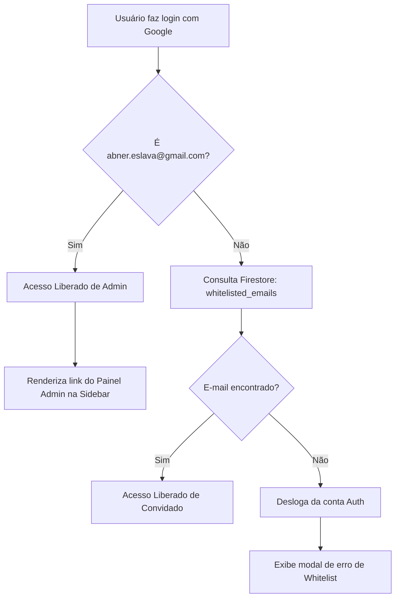

# Plano Técnico: Hub de Administrador (Whitelist)

Este plano descreve as etapas técnicas e de arquitetura para implementar o Painel de Controle de Convites em uma página dedicada (`admin.html`) e reforçar as regras de segurança no Firebase.

---

## 1. Resumo da solução

Construiremos uma nova página estática (`admin.html`) que atuará como Painel de Administração. O acesso a ela será estritamente bloqueado no cliente para qualquer e-mail diferente de `abner.eslava@gmail.com`. 

No front-end de `index.html`, o link de redirecionamento para o Painel Admin será inserido dinamicamente na Sidebar somente se a sessão ativa for do administrador. No fluxo de autenticação (`script.js`), adicionaremos uma consulta à coleção `whitelisted_emails` no Firestore para validar o e-mail de usuários comuns no ato de login.

---

## 2. Dependências

*   **Firebase SDK v10.8.1 (Auth & Firestore):** Utilizar para autenticação e manipulação da whitelist.
*   **Phosphor Icons:** Para consistência visual nos controles do painel.
*   **Folha de Estilos (`style.css`):** O painel herdará os tokens e o design do Selah.

---

## 3. Arquivos afetados

### [NEW] `admin.html`
*   Página HTML5 contendo a casca estrutural do painel admin.
*   Controles: Input de e-mail, botão "Convidar", barra de pesquisa, tabela/lista de convidados e modal de confirmação personalizado.

### [NEW] `admin.js`
*   Script ES6 que controla a página `admin.html`:
    *   Verifica a sessão ativa. Se o e-mail for diferente de `abner.eslava@gmail.com`, bloqueia e redireciona para `index.html` imediatamente.
    *   Gerencia o CRUD da coleção `whitelisted_emails` no Firestore.
    *   Exibe e filtra a listagem de convidados ativamente no cliente.

### `index.html`
*   **Modificação:** Alterar a Sidebar de `index.html` para incluir um container oculto ou dinâmico onde o link do Painel Admin será inserido programaticamente.

### `script.js`
*   **Modificação:** No escopo do `onAuthStateChanged`, validar se o e-mail logado existe na coleção `whitelisted_emails`. Se não existir (e não for o master), chamar `signOut(auth)`.
*   **Modificação:** Se for o administrador master, injetar dinamicamente o link do Painel Admin no menu lateral.

---

## 4. Estrutura de dados (Firestore)

### Coleção: `whitelisted_emails`
*   ID do Documento: E-mail higienizado em caixa baixa (Ex: `teste_gmail_com`) ou ID autogerado.
*   Documento:
    ```json
    {
      "email": "teste@gmail.com",
      "addedAt": "2026-05-23T22:00:00.000Z"
    }
    ```

---

## 5. Regras de segurança e permissões (Firebase Console)

O administrador precisa aplicar as seguintes Regras de Segurança (Security Rules) no painel do Cloud Firestore para garantir a proteção dos dados contra acessos não autorizados por APIs:

```javascript
rules_version = '2';
service cloud.firestore {
  match /databases/{database}/documents {
    
    // Regra da Whitelist
    match /whitelisted_emails/{docId} {
      // Qualquer usuário autenticado no Google pode checar se seu e-mail está na whitelist
      allow read: if request.auth != null && (
        request.auth.token.email.toLowerCase() == resource.data.email ||
        request.auth.token.email.toLowerCase() == 'abner.eslava@gmail.com'
      );
      // Apenas o e-mail Master Administrador pode adicionar ou excluir convidados
      allow write: if request.auth != null && request.auth.token.email.toLowerCase() == 'abner.eslava@gmail.com';
    }

    // Regra dos Devocionais
    match /devotionals/{docId} {
      // Usuários só podem ler e gravar devocionais que pertençam ao seu próprio userId
      // O administrador master tem acesso de leitura/escrita global
      allow read, write: if request.auth != null && (
        request.auth.token.email.toLowerCase() == 'abner.eslava@gmail.com' ||
        request.auth.uid == resource.data.userId || 
        request.auth.uid == request.resource.data.userId
      );
    }
  }
}
```

---

## 6. Fluxos técnicos



---

## 7. Impactos no sistema existente

*   **Sidebar unificada:** A sidebar precisa de injeção dinâmica de links. Para evitar problemas de replicação (já que temos sidebars estáticas em `oracoes.html` e `igreja.html`), o link do painel administrativo de convites deve funcionar perfeitamente de forma integrada.

---

## 8. Riscos técnicos

*   **Tentativa de burlar URL (`admin.html`):** Um usuário malicioso convidado pode tentar digitar diretamente `/admin.html` no navegador.
    *   *Mitigação:* A primeira linha executada em `admin.js` (antes de renderizar qualquer conteúdo) será a verificação de autenticação. Se o e-mail do Firebase Auth não for `abner.eslava@gmail.com`, o script limpa o corpo da página e dispara um redirecionamento forçado via `window.location.href = 'index.html'`.

---

## 9. Estratégia de teste

1.  **Bloqueio de Rota:** Acessar `/admin.html` sem estar logado. Deve redirecionar para `index.html`.
2.  **Bloqueio de Usuário Comum:** Logar com conta convidada (Ex: `convidado@gmail.com`) e tentar acessar `/admin.html`. Deve ser expulso para `index.html` e o link na sidebar não deve ser renderizado.
3.  **CRUD de Convites:** Logar como `abner.eslava@gmail.com`, acessar `/admin.html`, adicionar um e-mail novo e revogá-lo. Confirmar se as mudanças aparecem em tempo real e são gravadas no Firestore.
