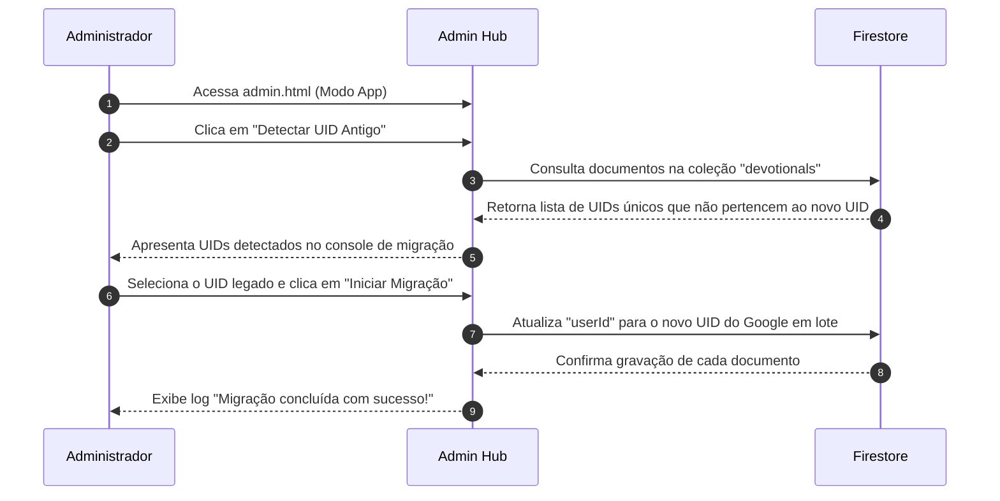

# Plano Técnico: Login com Google

Este plano descreve a abordagem técnica para substituir o sistema de autenticação de E-mail/Senha pelo Google Sign-In via Pop-up, e a criação da ferramenta temporária e manual de migração de histórico de registros no Hub Administrativo.

---

## 1. Resumo da solução

Substituiremos a autenticação baseada em credenciais tradicionais no Firebase Auth pelo provedor do Google (`GoogleAuthProvider`). O fluxo utilizará pop-up (`signInWithPopup`) conforme decisão oficial do projeto.

No ato do login, validaremos se o e-mail autenticado pertence à whitelist (ou se é o e-mail do administrador master `abner.eslava@gmail.com`). Se o e-mail não estiver autorizado, o usuário será imediatamente deslogado (`signOut`) e uma mensagem de recusa será exibida.

Para mitigar a perda de dados de Abner devido ao descarte do login legado, implementaremos uma **Área de Migração Temporária** no Hub Administrativo (`admin.html` e `admin.js`), contendo uma ferramenta visual com capacidade de detectar UIDs legados nos devocionais/bênçãos e atualizá-los em lote para o seu novo UID do Google.

---

## 2. Dependências

*   **Firebase Auth (v10.8.1):** Importar `GoogleAuthProvider`, `signInWithPopup`, `signOut` do SDK.
*   **Firebase Firestore:** Realizar queries e escritas nas coleções `whitelisted_emails`, `devotionals` e `blessings`.

---

## 3. Arquivos afetados

### `index.html`
*   *Nota:* O formulário antigo de login por e-mail e senha já foi inteiramente removido e substituído pelo botão do Google em fases anteriores do projeto.

### `script.js`
*   *Nota:* O fluxo de login por pop-up já está configurado na raiz da aplicação. O arquivo continuará usando `signInWithPopup(auth, provider)`.

### `admin.html`
*   **Novo Recurso (Temporário):** Adicionar no final da página, antes do fechamento do contêiner principal, o bloco HTML da ferramenta de migração, contendo explicações claras, inputs, botões ("Detectar UIDs", "Migrar Histórico") e um painel de console visual para logs. Todo o bloco será envolto em comentários `<!-- INÍCIO DA ÁREA DE MIGRAÇÃO TEMPORÁRIA -->` para remoção facilitada.

### `admin.js`
*   **Novo Recurso (Temporário):** Implementar as rotinas JavaScript para buscar UIDs antigos únicos que não pertençam a Abner nem aos convidados da whitelist. Implementar a rotina de atualização (Firestore batch/documents modification) de `userId` nas coleções `devotionals` e `blessings` para o novo UID do administrador e imprimir logs dinâmicos. Envolver o código em comentários `// INÍCIO DA ÁREA DE MIGRAÇÃO TEMPORÁRIA` para deleção segura.

---

## 4. Estrutura de dados

*   Não há alterações estruturais nos documentos das coleções `devotionals` ou `blessings`. Apenas o campo `userId` dos registros pertencentes ao UID legado será atualizado para o novo UID do Google Auth.

---

## 5. Regras de segurança e limitações de Popup

> [!WARNING]
> **Ponto de Atenção: Restrições de Pop-up**
> A chamada `signInWithPopup` abre uma janela flutuante externa. Em navegadores mobile (como o Safari no iOS) ou quando o aplicativo roda em modo PWA standalone (instalado na tela inicial como app), pop-ups são bloqueados agressivamente. Deve-se manter esse ponto em observação caso seja necessária uma transição futura para métodos baseados em redirecionamento.

---

## 6. Fluxos técnicos da Ferramenta de Migração

---

## 7. Impactos no sistema existente

*   **Ferramenta Temporária:** A ferramenta opera exclusivamente na página de administração, não gerando qualquer impacto na usabilidade do app principal (`index.html`) ou nos tempos de resposta de login dos membros regulares.
*   **Deleção Segura:** A separação estrita do código garante que a deleção futura da ferramenta demore menos de 1 minuto, sem qualquer risco de quebrar a lógica de gerenciamento de convites.

---

## 8. Estratégia de teste

1.  **Teste de Detecção:** Clicar no botão "Detectar UID Antigo" na página `admin.html` e verificar se ele exibe na tela os UIDs que não pertencem à sua conta ativa ou de seus convidados.
2.  **Teste de Atualização:** Informar o UID legado e iniciar a migração. Verificar se os devocionais históricos salvos no Firestore passam a exibir seu novo UID do Google, aparecendo de imediato na sua aba de Registros do SelahApp.
